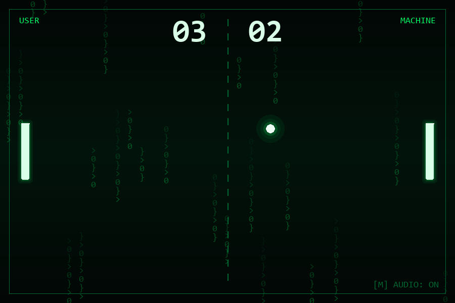

# Py-Pong // Matrix Protocol

> 🇪🇸 Un pequeño Pong contra la máquina, creado para practicar Python durante mis
> estudios de DAW y convertido después en un proyecto completo de portfolio.

[](https://github.com/PierreLaGuerre/py-pong/actions/workflows/ci-pages.yml)
[](https://www.python.org/)
[](LICENSE)

**[Play the browser version](https://pierrelaguerre.github.io/py-pong/)**



A compact, Matrix-inspired Pong game written in Python. Challenge a deliberately
imperfect computer opponent, reach seven points first, and try not to become part
of the simulation.

## Highlights

- Complete match flow: ready, play, pause, game over, and restart.
- CPU opponent with limited speed, reaction delay, and a dead zone.
- Angle-based paddle rebounds and progressively faster rallies.
- Procedural neon rendering and generated retro sounds—no heavy media assets.
- Pure game rules separated from Pygame rendering and covered by tests.
- Browser build powered by Pygbag/WebAssembly and deployed through GitHub Actions.

## Controls

| Key | Action |
| --- | --- |
| `W` / `S` or `↑` / `↓` | Move your paddle |
| `Space` | Start the match |
| `P` | Pause or resume |
| `R` | Restart |
| `M` | Mute or enable audio |
| `Esc` | Exit the desktop game |

## Run locally

Python 3.10 or newer is recommended.

```bash
python -m venv .venv
```

Activate the environment, then run:

```bash
pip install -r requirements.txt
python main.py
```

Run the automated tests with:

```bash
pip install -r requirements-dev.txt
python -m pytest
```

## Browser build

```bash
python -m pygbag .
```

Open the local URL shown by Pygbag. The first browser load can take a little
longer while the Python and Pygame WebAssembly runtime is downloaded and cached.

Every push to `main` runs the test suite, builds the browser version, and deploys
it to GitHub Pages. In the repository settings, GitHub Pages must use **GitHub
Actions** as its source.

## Architecture

The domain layer (`Game`, `Ball`, `Paddle`, and `ComputerPlayer`) contains the
rules without importing Pygame. The application loop translates input into game
updates, while the renderer and audio manager handle presentation. This keeps the
physics deterministic and easy to test without opening a window.

## Tech stack

Python · Pygame CE · Pytest · Pygbag · WebAssembly · GitHub Actions

## License

Released under the [MIT License](LICENSE).
